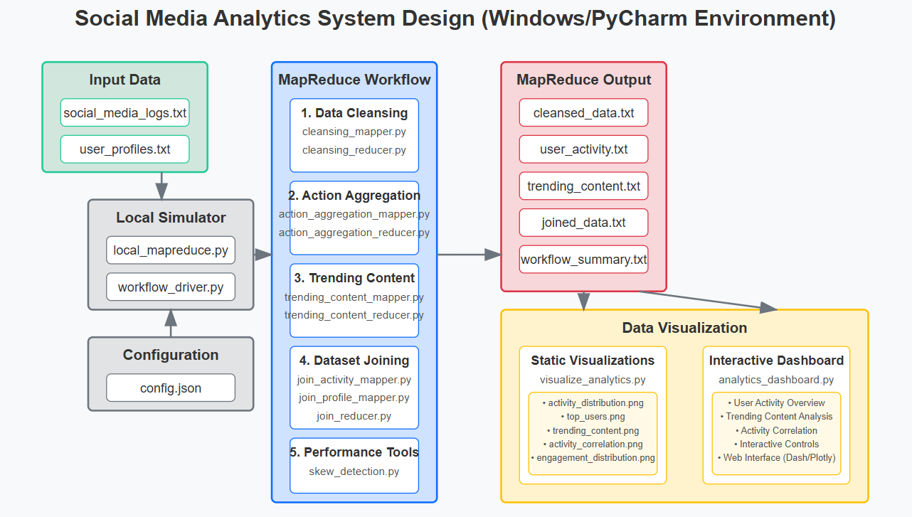

# MapReduce Pipeline for Social Media Data Analysis

This project implements a multi-stage MapReduce workflow designed to process and analyze social media datasets. By examining `social_media_logs.txt` and `user_profiles.txt`, this system extracts behavior patterns, highlights popular content, and generates insights by connecting user activities with profile information.

## Core Framework

The analysis pipeline consists of five sequential phases:

1. **Data Preprocessing & Validation** - Cleans and structures the raw input data
2. **User Activity Compilation** - Collects and ranks user interactions by frequency
3. **Popular Content Detection** - Identifies high-engagement content 
4. **Data Integration** - Merges activity metrics with demographic information
5. **Results Presentation** - Converts findings into visual representations

## Framework Diagram



Processing sequence:
- Raw data enters the MapReduce processing environment
- Each processing phase generates outputs that serve as inputs for subsequent stages
- Final data products support visualization and analytical review

## System Requirements

Windows environment setup:
- Windows OS
- Python 3.6 or newer
- PyCharm development environment
- Dependencies: numpy, psutil, matplotlib, pandas, dash, plotly, scipy

## Directory Organization

```
project_root/
├── config.json                   # Settings and parameters
├── README.md                     # Project documentation
│
├── data/                         # Input datasets
│   ├── social_media_logs.txt     # Activity record dataset
│   └── user_profiles.txt         # User information dataset
│
├── output/                       # Results storage (auto-created)
│   ├── cleansed_data.txt         # Validated data output
│   ├── user_activity.txt         # Compiled user actions
│   ├── trending_content.txt      # High-engagement content
│   ├── skew_analysis.json        # Distribution analysis results
│   ├── joined_data.txt           # Integrated dataset
│   └── workflow_summary.txt      # Execution report
│
├── src/                          # Code components
│   ├── cleansing_mapper.py       # Validation mapper
│   ├── cleansing_reducer.py      # Validation reducer
│   ├── action_aggregation_mapper.py    # Activity collection mapper
│   ├── action_aggregation_reducer.py   # Activity collection reducer
│   ├── trending_content_mapper.py      # Engagement mapper
│   ├── trending_content_combiner.py    # Intermediate processor
│   ├── trending_content_reducer.py     # Engagement analyzer
│   ├── social_media_analytics_driver.py    # Workflow controller
│   ├── join_activity_mapper.py    # Activity integration mapper
│   ├── join_profile_mapper.py     # Profile integration mapper
│   ├── join_reducer.py            # Integration processor
|   ├── visualize_analytics.py     # Static visualization tool
│   ├── analytics_dashboard.py     # Interactive results viewer
│   ├── skew_detection.py          # Distribution analysis utility
│   └── memory_monitor.py          # Resource tracking utility
│
└── visualizations/               # Graphics output directory
```

## Starting Guide

1. **Get the project files**

2. **Set up the environment**
   ```
   pip install numpy psutil matplotlib pandas dash plotly scipy
   ```
3. **Extract large datasets**
    ```
    social_media_logs.zip
    cleansed_data.zip
    ```
3. **Execute the full pipeline**
   ```
   python social_media_analytics_driver.py --config config.json
   ```

4. **Create data visualizations**
   ```
   python visualize_analytics.py --input-dir output --output-dir visualizations
   ```

5. **Start the analysis dashboard**
   ```
   python analytics_dashboard.py
   ```

## Component Details

### 1. Data Preprocessing & Validation

This phase processes the raw activity logs:
- Extracts Timestamp, UserID, ActionType, ContentID, and Metadata from tab-delimited records
- Verifies timestamp formats and JSON structure
- Removes invalid entries
- Maintains records of excluded data

Implementation:
- `cleansing_mapper.py` - Handles entry validation
- `cleansing_reducer.py` - Forwards validated records

### 2. User Activity Compilation

This phase aggregates interaction metrics:
- Tallies posts, likes, comments, and shares per user
- Orders results by post frequency (descending)
- Implements multi-level sorting

Implementation:
- `action_aggregation_mapper.py` - Counts activities by user
- `action_aggregation_reducer.py` - Structures and sorts output

### 3. Popular Content Detection

This phase identifies high-engagement content:
- Calculates total engagement (likes + shares) for content items
- Sets popularity threshold at the 90th percentile
- Addresses data concentration issues

Implementation:
- `trending_content_mapper.py` - Tracks engagement metrics
- `trending_content_combiner.py` - Performs local data reduction
- `trending_content_reducer.py` - Applies threshold analysis

### 4. Data Integration

This phase connects activity data with user profiles:
- Merges interaction data with demographic information
- Uses reducer-side joining technique
- Handles distribution imbalances for highly active users

Implementation:
- `join_activity_mapper.py` - Prepares activity records
- `join_profile_mapper.py` - Prepares profile records
- `join_reducer.py` - Performs integration
- `skew_detection.py` - Manages data distribution issues

### 5. Results Presentation

This phase visualizes the analytical findings:
- Produces static visual representations
- Offers interactive data exploration

Implementation:
- `visualize_analytics.py` - Generates image-based visualizations
- `analytics_dashboard.py` - Provides browser-based exploration

## Performance Enhancements

Several techniques improve processing efficiency:

### Code Optimizations
1. **Mapper-side aggregation** - Reduces intermediate data through in-memory processing
2. **Strategic data structures** - Selects optimal structures for each operation
3. **Built-in sorting** - Arranges output without additional processing
4. **Intermediate reduction** - Applies combiners for early data consolidation

### System Optimizations
1. **Distribution analysis** - Identifies and addresses processing imbalances
2. **Resource monitoring** - Tracks system utilization
3. **Adaptive processing** - Adjusts reducer count based on data volume

## Running Specific Components

For testing individual pipeline stages:

```
# Data validation only
python local_mapreduce.py --job cleansing --input-dir data --output-dir output

# Activity compilation only
python local_mapreduce.py --job aggregation --input-dir output --output-dir output

# Popularity analysis only
python local_mapreduce.py --job trending --input-dir output --output-dir output

# Integration only
python local_mapreduce.py --job join --input-dir output --output-dir output
```

## Visualization Options

### Static Graphics

The `visualize_analytics.py` script creates several visual outputs:

- `activity_distribution.png` - Activity type breakdown
- `top_users.png` - Most active user comparison
- `trending_content.png` - Top content by engagement
- `activity_correlation.png` - Relationship map of activity types
- `engagement_distribution.png` - Engagement score distribution

Generate with:
```
python visualize_analytics.py --input-dir output --output-dir visualizations
```

### Interactive Analysis Tool

The `analytics_dashboard.py` provides a web-based interface featuring:

- User Activity Summary
- Engagement Analysis
- Behavior Correlation View
- Dynamic filtering controls

Launch with:
```
python analytics_dashboard.py
```
Then visit http://127.0.0.1:8050/ in your browser

## Problem Resolution

If you encounter issues:

1. **Verify path settings** - Confirm paths in config.json are accurate
2. **Check data formatting** - Ensure input files match expected structure
3. **Verify dependencies** - Confirm all required packages are installed
4. **Examine log files** - Review workflow.log for specific error details
